# Prex Challenge

A Laravel REST API integrating with GIPHY, featuring:

- OAuth2 authentication via Laravel Passport
- Search GIFs
- Retrieve GIF by ID
- Save favorite GIFs
- Request audit logging  

---

## Requirements

- Docker & Docker Compose
- PHP 8.3+
- Composer
- Node.js 16+ & npm (optional for local asset compilation)
- GIPHY API key (register at https://developers.giphy.com/)

---

## Installation

1. **Clone repository & enter folder**

    ```bash
    git clone git@github.com:dacapdevila/prex-challenge.git
    cd prex-challenge
    ```

2. **Copy env file & configure**

    ```bash
    cp .env.example .env
    # Edit .env: set GIPHY_KEY.
    ```

3. **Build & start containers**
 
   ```bash
   docker compose \
    -f docker-compose.yml \
    -f docker-compose.override.yml \
    --profile dev \
    up -d --build
   ```

4. **Run database migrations & Passport**

   ```bash
   docker compose exec app php artisan migrate
   docker compose exec app php artisan passport:install --force --no-interaction
   docker compose exec app php artisan passport:restore
   ```

---

## Testing

1. **Run all tests:**

   ```bash
   docker compose exec app composer test
   ```
   
2. **Generate code coverage report:**

   ```bash
   docker compose exec app vendor/bin/phpunit --coverage-html storage/coverage
   docker compose exec app php artisan passport:restore
   open storage/coverage/index.html
   ```
3. **You will see the current code coverage:**
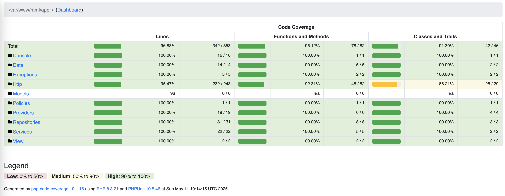

---

## Use Cases Diagrams

- **General**
  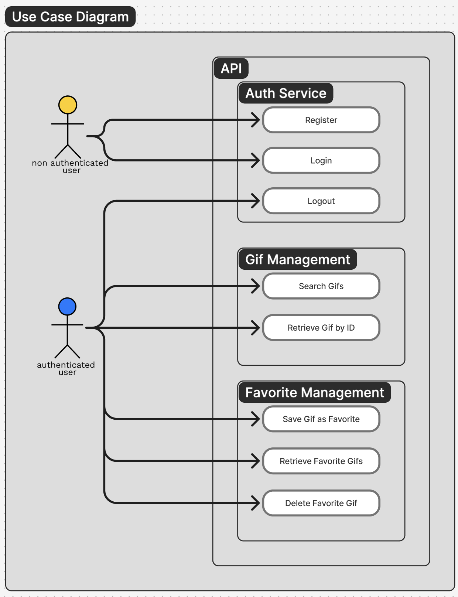

---

## Sequence Diagrams

### Auth Service

- **Register**
  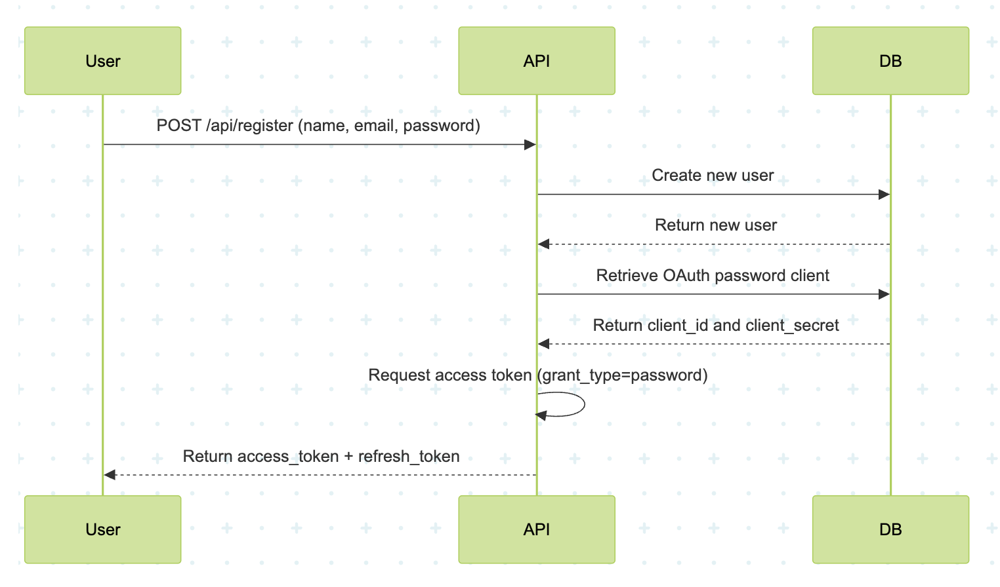

- **Login**
  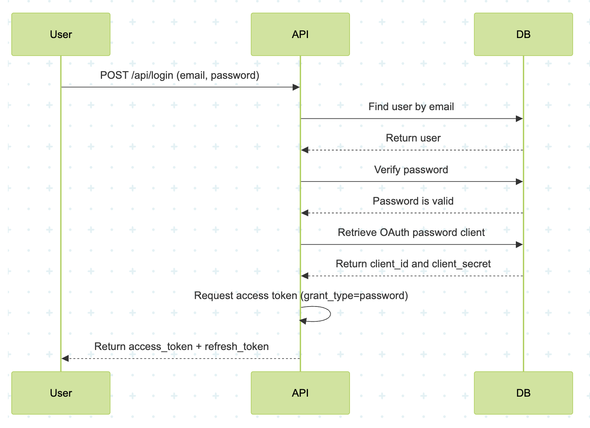

- **Logout**
  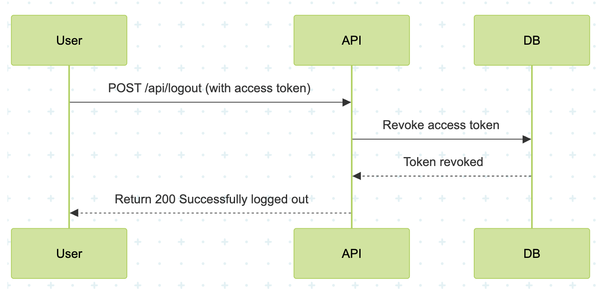

### GIF Management

- **Search GIFs**
  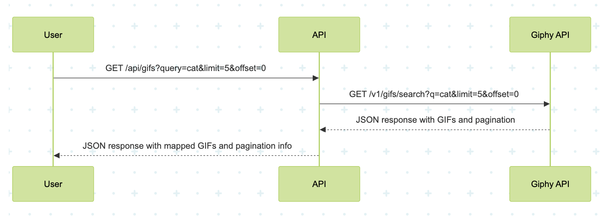

- **Retrieve GIF by ID**
  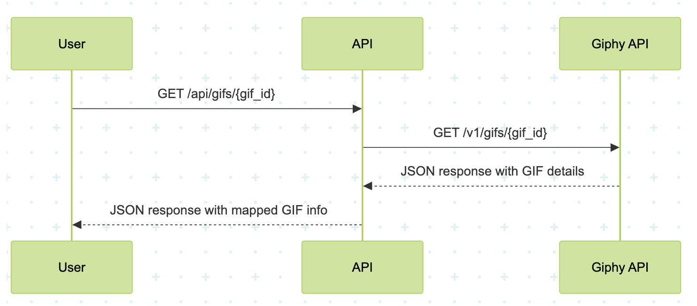

### Favorite Management

- **Save GIF as Favorite**
  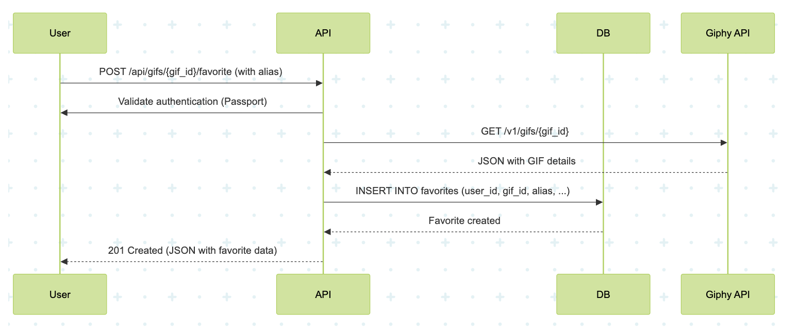

- **List Favorite GIFs**
  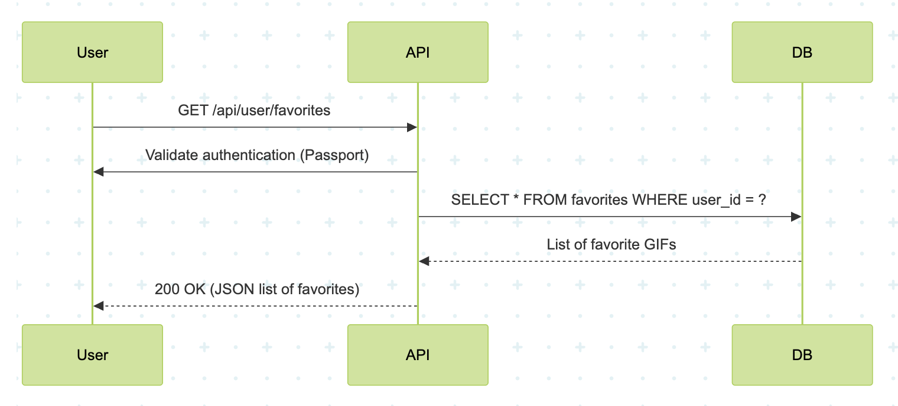

- **Delete Favorite GIF**
  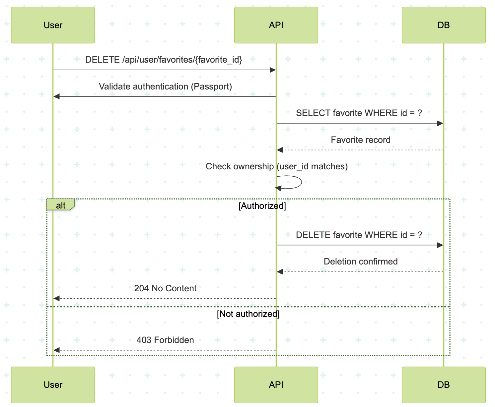

---

## Data Diagram - Entity Relationship Diagram

- ** Data Diagram **
  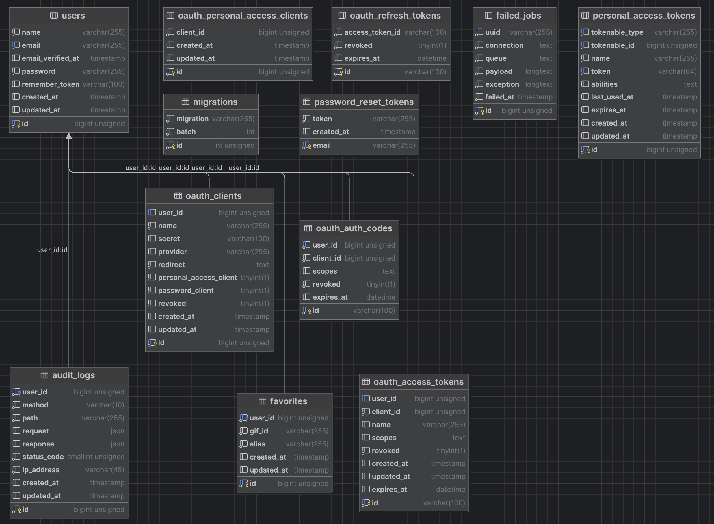

---

## API Documentation

- Docs: https://documenter.getpostman.com/view/11336555/2sB2jAaTL9
- Import Postman Collection with all the end points

[](https://god.gw.postman.com/run-collection/:2sB2jAaTL9?action=collection%2Ffork&source=rip_markdown&:collection_url)

---

